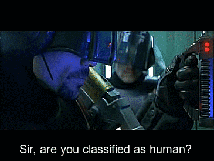

  

---

# Reinforcement Learning

## Overview

This repository contains implementations and studies of several state-of-the-art and foundational Reinforcement Learning algorithms. The goal is to provide clear, well-documented examples and to explore their performance across different environments.

## Algorithms Covered

We aim to cover a range of algorithms, including (but not limited to):

* **Proximal Policy Optimization (PPO):** A state-of-the-art algorithm known for its stability and performance, balancing exploration and exploitation effectively.
* **Deep Q-Networks (DQN):** A foundational algorithm in deep reinforcement learning that excels in discrete action spaces.
* ... and more to come as the project evolves!

## Libraries & Tools Utilized

This project leverages several powerful libraries and frameworks for building and training RL agents:

* **Ray RLlib:** A highly scalable and flexible open-source library for reinforcement learning that offers a wide range of algorithms and supports complex distributed setups.
* **TF-Agents:** A library for reinforcement learning in TensorFlow 2, designed for flexibility and good integration with the TensorFlow ecosystem.
* **Stable Baselines3 (SB3):** A set of reliable implementations of reinforcement learning algorithms in PyTorch.

## Environments Tested

* **Car Racing v3**
* **Lunar Lander v3**

